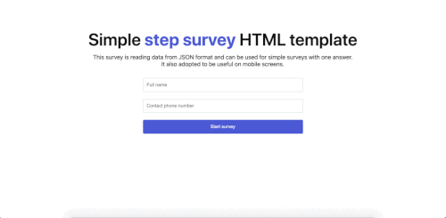

# Description

Simple HTML markup for step survey with output as object.

[Demo link](https://af23me.github.io/step-survey-html-template/)



# Incoming data format

```
[
  {
    description: "How often you use such surveys?",
    answers: [
      "Often",
      "Not really"
    ]
  },
  {
    description: "Please tell your expirience using this form",
    answers: [
      "Really cool",
      "Should be improved"
    ]
  }
]
```

# Output data format

```
{
  name: "Test user",
  phone: "12345678",
  answers: {
    1: "First selected answer",
    2: "Second selected answer"
  }
}
```
